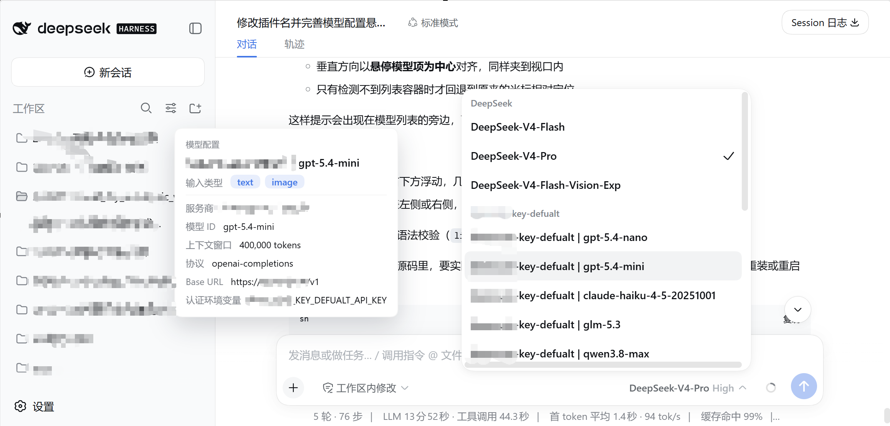

# dsh-model-info-hint

A DeepSeek Harness (DSH) plugin: in the Web GUI model picker, hovering over a candidate model pops up a hint showing that model's full configuration — the input types it accepts (`text`, `image`, …), context window, max output tokens, reasoning efforts, plus the owning provider's protocol (`api`), `baseURL`, and credential environment variable name (`apiKeyEnv`).

Configuration is read from the user's settings document (by default `~/.dsh/settings.yaml`, or `$DSH_HOME/settings.yaml`) through DSH's built-in settings service — so `$DSH_HOME` overrides, hot-reload, and both `.yaml`/`.json` documents are supported automatically.

## Screenshot



## How it works

The plugin is split in two halves, mirroring `dsh-archived-conversation`:

- **Host side** (`lib/index.js`): injects the `settings` and `webServer` services and registers a
  same-origin JSON endpoint `GET /model-info-hint/api/models` that returns, in one shot, the full
  configuration of every model in the settings document, keyed by
  `(provider display name, model display name)`.
- **Browser side** (`lib/client.js`): listens for a global `mouseover`. When the cursor rests on a
  model in the model picker (both the composer model seat and the `/model` popup), it resolves the
  hovered item's visible text against that map and renders a non-blocking detailed hint next to the
  cursor.

The typical model-routing structure in the settings document (the `llm-pi-ai` namespace):

```yaml
llm-pi-ai:
  providers:
    my-provider:
      displayName: My Provider        # optional; defaults to the key
      api: openai-completions         # optional wire protocol
      baseURL: https://example/v1     # optional endpoint
      apiKeyEnv: MY_API_KEY           # optional credential env var name
      defaultInput:                   # optional provider-level fallback
        - text
        - image
      models:
        - id: gpt-5.4-nano
          name: My Provider | gpt-5.4-nano   # optional; defaults to the id
          contextWindow: 400000       # optional context window
          maxTokens: 32768            # optional max output
          input:                      # optional per-model override, highest priority
            - text
            - image
          reasoningEfforts:           # optional reasoning levels
            high: high
            low: low
```

Input-type resolution order: model's own `input` → provider `defaultInput` → `["text"]`. The lookup is
generic: the plugin scans the `providers` dict of every registered settings namespace, so it is not
limited to `llm-pi-ai` — any adapter that stores routes under this shape is matched.

## Installation

Add this directory as a local package to the `web` profile (or whichever profile you use), then restart DSH:

```sh
# Install from a local path
dsh plugin --profile web add file:/absolute/path/to/dsh-model-info-hint

# Then restart the web UI for the new plugin to take effect
dsh web
```

If the plugin is published to npm, you can also install it directly:

```sh
dsh plugin --profile web add dsh-model-info-hint
dsh web
```

No configuration is required after installation: open the model picker (the composer's model button, or
the `/model` command) and hover over a model to see its detailed configuration hint.

## Directory structure

```
dsh-model-info-hint/
├── package.json        # dsh.client / dsh.bundle declarations
├── cordis.patch.yml    # activates the plugin row in a profile
├── images/
│   └── screenshot.png       # screenshot
├── lib/
│   ├── index.js        # host: reads settings + exposes the HTTP endpoint
│   └── client.js       # browser: hover detection + detailed config hint
├── README.md           # Chinese version (GitHub default)
├── README.en.md        # this file (English)
├── README.cn.md        # Chinese version copy
└── LICENSE
```

## Notes

- The hint is non-blocking (`pointer-events: none`), so it never intercepts hover or clicks.
- The hint disappears when the pointer leaves the model, on click, on scroll, or on any key press, and
  auto-dismisses after 6 seconds so it never lingers after the menu closes.
- The hint only shows fields declared in `~/.dsh/settings.yaml`; fields that were not explicitly set
  (for example a `contextWindow` inherited from the catalog) are omitted. `input` always shows because
  it has provider / default fallbacks.
- `apiKeyEnv` shows the environment variable **name** (e.g. `BEEROUTE_KEY_DEFUALT_API_KEY`), not the
  secret itself — the settings document stores only the variable name.
- Only adapters that declare models in the settings document are covered; a built-in adapter such as
  `deepseek-official`, which is not described in `~/.dsh/settings.yaml`, shows no hint.
- The UI text is in Chinese, and input type names (`text`/`image`, …) match the settings document.
